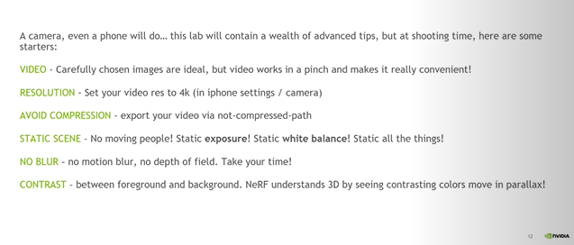

# Instant Neural Graphics Primitives

Idee achter NeRF = Neem een positie in de ruimte → voer dit aan een NN → NN vertelt iets over dit punt (kleur voor NeRF, afstand voor distance field,..) 

De gewichten en biases van een NN houden de data van een volledige afbeelding in zich → wat als we netwerk een working set of memory geven om data bij te houden om zo de afbeelding accurater te kunnen herstellen? → **hashgrid**  → punten in ruimte worden gemapt naar grids in GPU memory → NN kan veel kleiner zijn  → working memory kan lokale features voorzien aan NN 

NeRFs is eigenlijk een soort van inverse rendering → we nemen afbeeldingen en tracen rays door de pixels en we vragen het netwerk om een volumetrische representatie te genereren van de scene dat consistent is van alle views. Het netwerk zal dus een volume vinden gemaakt van density (is er iets of niet) en kleur  (wat is de kleur op dit punt op deze view directie) en het zoekt naar iets dat consistent is met alle afbeeldingen.

Zeer belangrijk om intrisieke en extrinsieke data van camera te weten hoe afbeeldingen zijn genomen. Dit kan je via COLMAP berekenen.

NeRF is truely volumetrisch ↔   photogrammetry (kan zeer goed dingen die via 🔺 te representeren zijn voorstellen), NeRF heeft geen enkele inclinatie om iets als solid te representeren dus bv zeer goed voor vacht.

**Garbage in garbage out**: Hoe beter de input image kwaliteit hoe beter de image reconstructie → probeert letterlijk images te projecteren in een volume en afbeeldingen uit te leggen via density en color field.

**Let op volgende zaken bij het zelf genereren van data:** 
 

- **NeRF learns by PARALLAX → consistentie vinden in zelfde punt van meerdere views**
- **NeRF LOVES contrast**

**Tips om NeRF models te trainen:**

[instant-ngp/nerf_dataset_tips.md at master · NVlabs/instant-ngp](https://github.com/NVlabs/instant-ngp/blob/master/docs/nerf_dataset_tips.md)

- Camera parameters in transforms.json compatibel met NeRF codebase → script is voorzien om via COLMAP data om te zetten naar juiste formaat
- Training proces is heel picky over data → goede coverage, juiste camera labels, geen blurry images (motion blur en defocus blur zijn beiden problematisch)
- Na ~ 20s zal resultaat niet meer drastisch verbeteren
- For natuurscenes met achtergrond buiten de unit cube → aabb scale naar macht van 2
- aabb scale = extent van de scene, default = 1 → camera posities gemiddelde afstand van 1 van de oorsprong verwijderd → rays worden gecast tot deze bounding box
- 50 - 150 images is ideaal
- Weinig to geen scene movement, motion blur of andere blur artefacten
- Accurate camera posities zijn zeer belangrijk
- Images met 1 point of interest